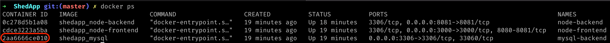

# ShedApp Getting Started

## Installation
1. Ensure you have [docker](https://www.docker.com) installed.
2. Navigate to the parent directory of the project.
3. Run command `docker-compose up`.
4. Navigate to `http://localhost:3000`.

## Getting Started

### Using the application
To use the application, by default you can login with the following credentials:  
**username:** superuser  
**password:** superpassword  

### Accessing the individual docker containers

**SQL container:**  
Once installed you can access the sql container by doing the following:
1. Run command `docker ps` to identify the name of your mysql container. For example:  

2. Run command replacing the `<name>` with your container name:  
`docker exec -it <name> mysql -uroot -p12345`

**Node Server container:**  
1. Run command `docker ps` to identify the name of your `shedapp_node-backend` container.
2. Run command replacing the `<name>` with your container name:  
`docker exec -it <name> bash`

**React Server container:**  
1. Run command `docker ps` to identify the name of your `shedapp_node-frontend` container.
2. Run command replacing the `<name>` with your container name:  
`docker exec -it <name> bash`